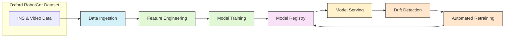

```mermaid
graph LR
    A[Data Ingestion] --> B[Feature Engineering]
    B --> C[Model Training]
    C --> D[Model Registry]
    D --> E[Model Serving]
    E --> F[Drift Detection]
    F --> G[Automated Retraining]
    G --> D
    
    classDef ingestion fill:#d4f1f9,stroke:#333,stroke-width:1px
    classDef processing fill:#e1f7d5,stroke:#333,stroke-width:1px
    classDef model fill:#f9e1f7,stroke:#333,stroke-width:1px
    classDef serving fill:#fff2cc,stroke:#333,stroke-width:1px
    classDef monitoring fill:#ffe6cc,stroke:#333,stroke-width:1px
    
    class A ingestion
    class B,C processing
    class D model
    class E serving
    class F,G monitoring
    
    subgraph Oxford RobotCar Dataset
    Raw[INS & Video Data]
    end
    
    Raw --> A
``` 